# Building the Monster

 - All of the BAG-2 bags opened and the base built from the BAG-1's

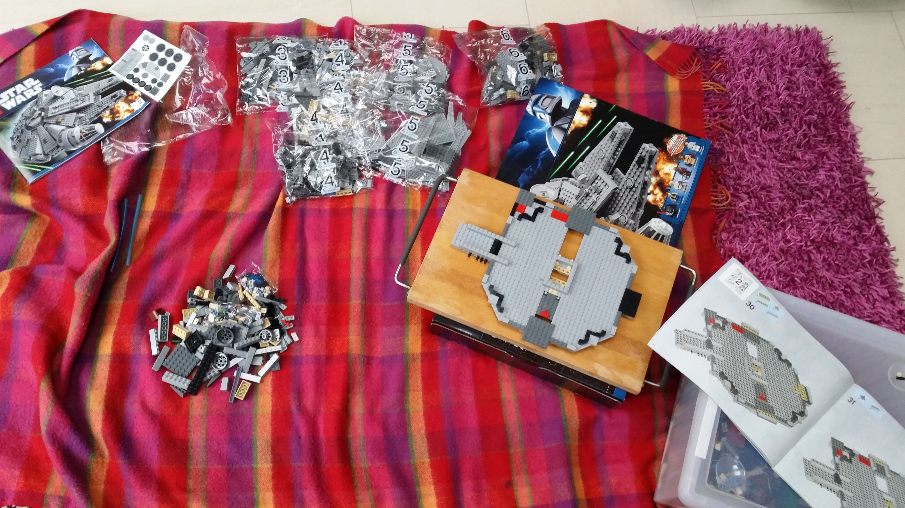

 - Inside starting to take shape

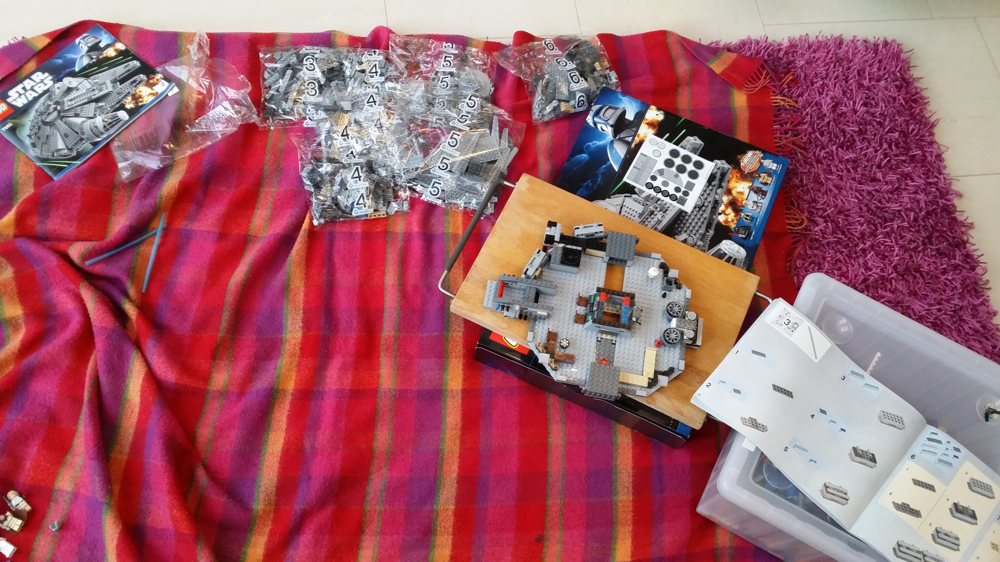

 - It even has a sick-bay! (bottom right)

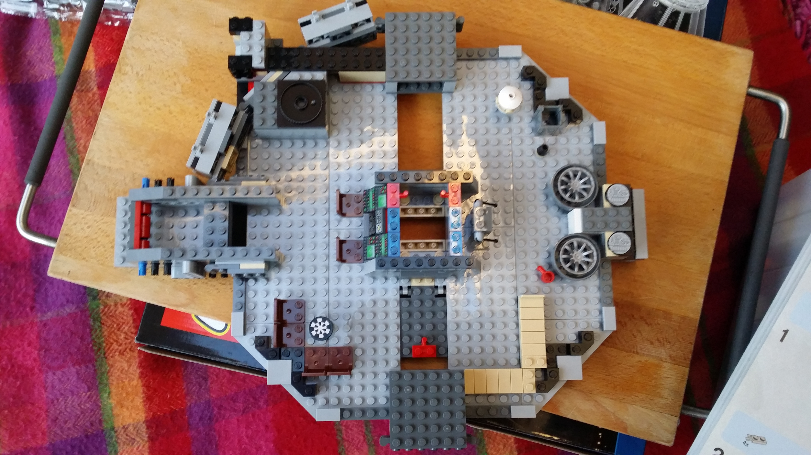

 - The level of detail is nuts. Check out that keyboard! I'm fuckin' sure it's PS2 ;)

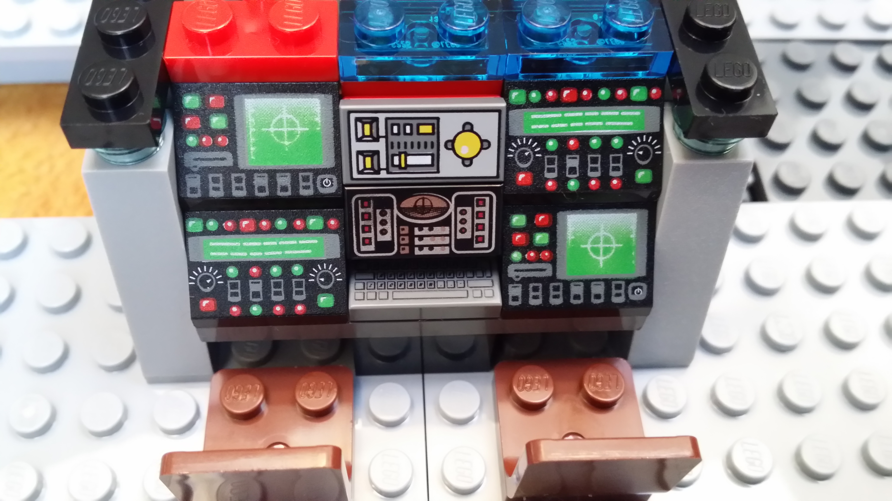

 - All the BAG-3 stuff built.

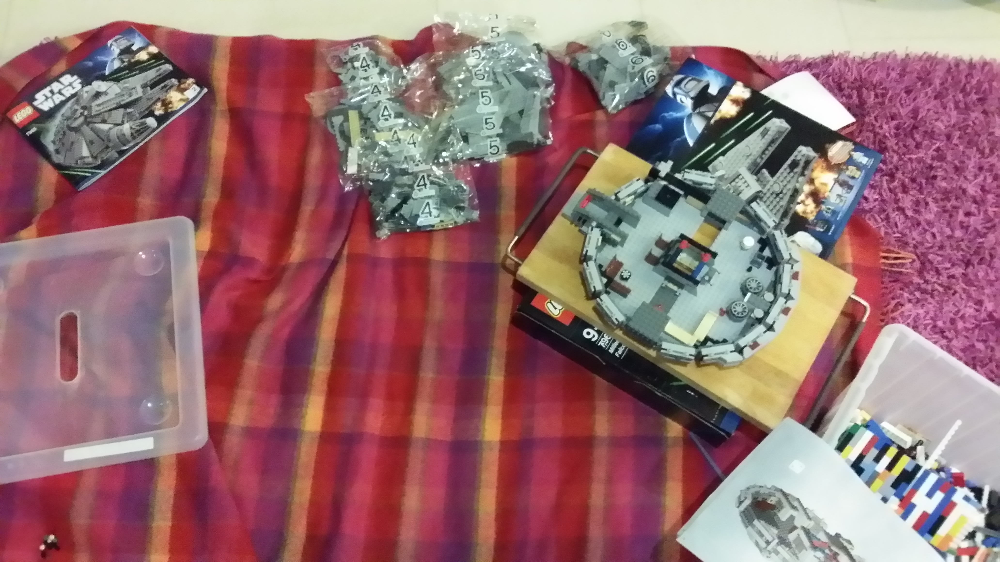

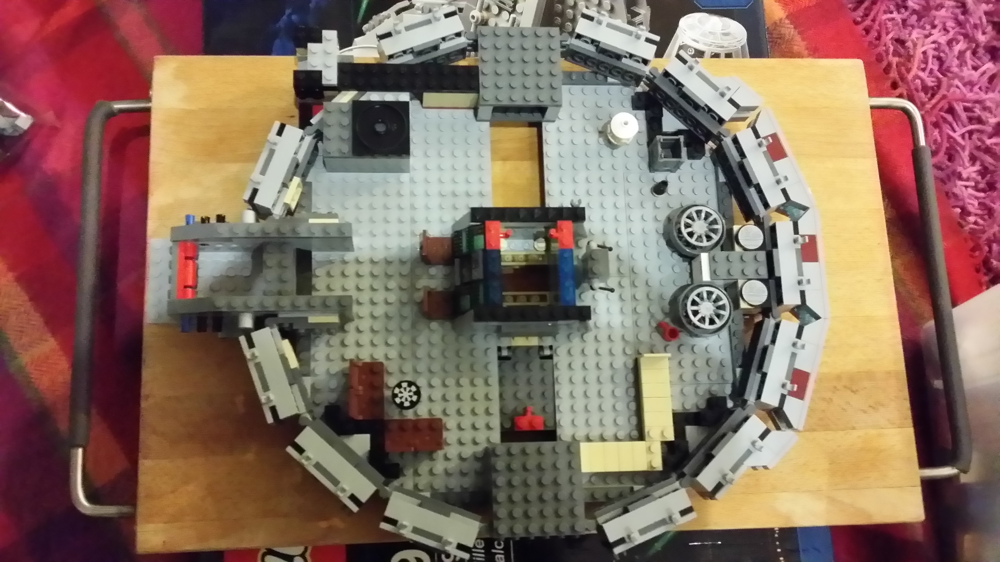

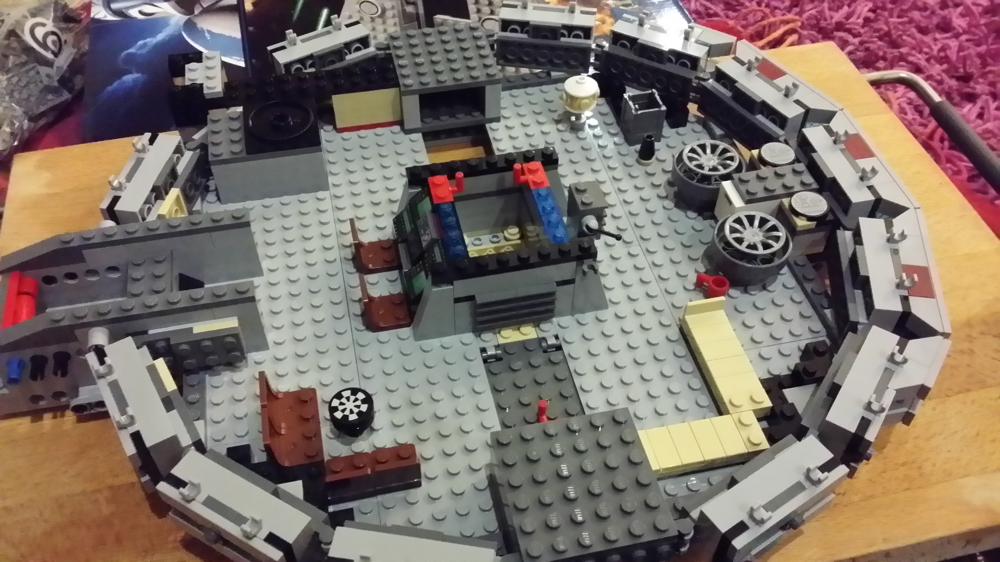

 - Outside shell added from the BAG-4 and BAG-5 ones.

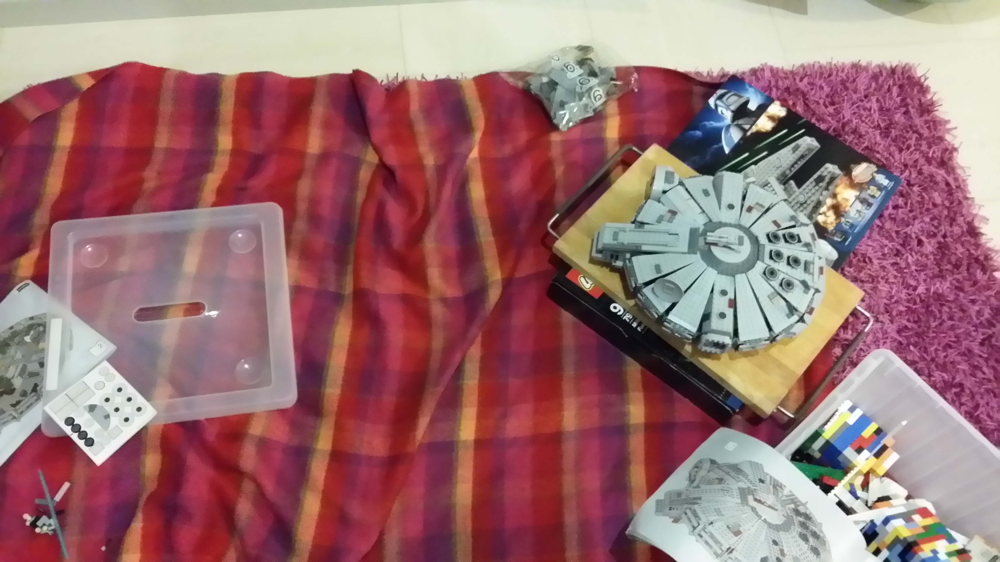

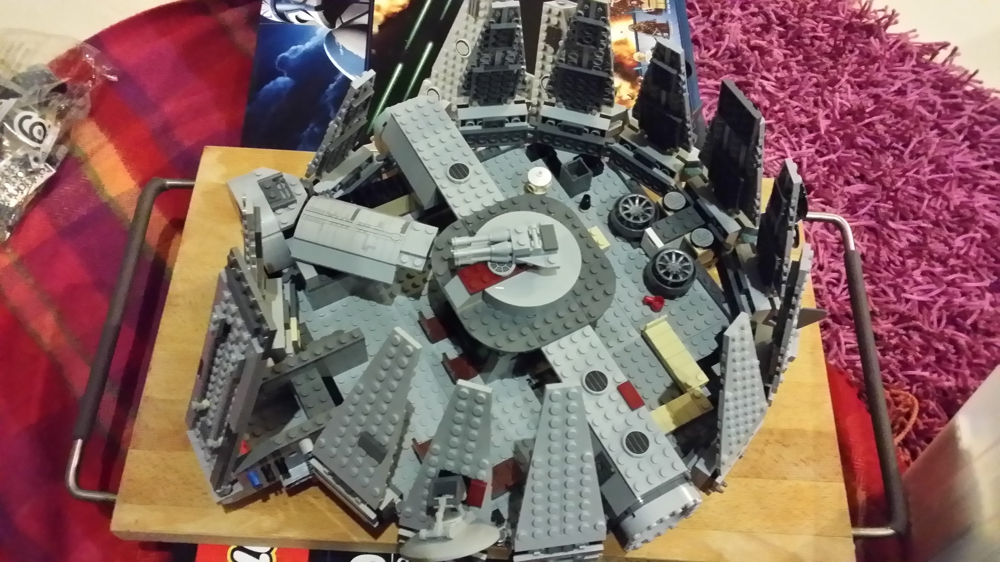

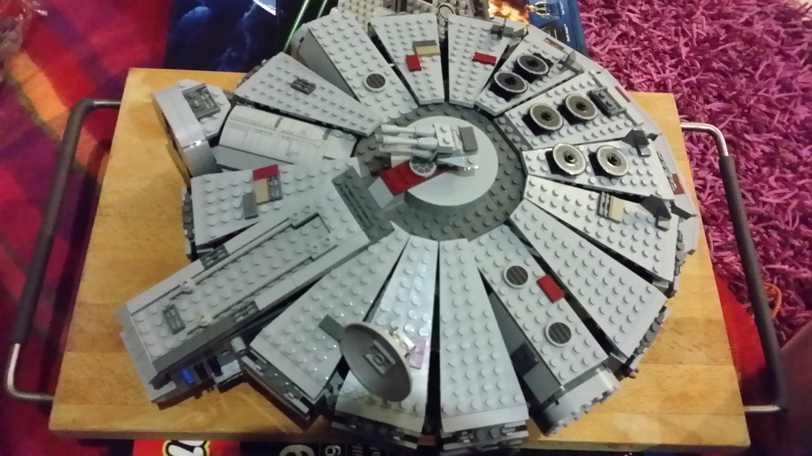

 - Finally complete. 

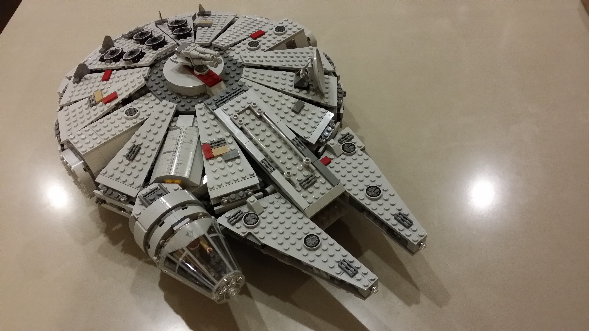

Hardly any humans were harmed during the making of this project. Han Solo had to be washed though after he threw himself into a full cup of coffee on the floor - Typical Solo!

Awesome gift folks. Thanks very much!

